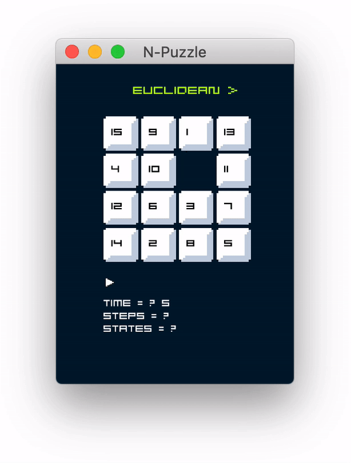

# <!--     --> N-Puzzle  

  

 Implementation of A* search algorithm to solve N-puzzles
 ([_пятнашки_](https://ru.wikipedia.org/wiki/%D0%98%D0%B3%D1%80%D0%B0_%D0%B2_15),
 [_15-Puzzle_](https://en.wikipedia.org/w/index.php?title=15_puzzle&oldid=1086625326), taquin) 

[//]: # ( )
<!--   -->
 
## О Проекте
Алгоритм А* - информированный алгоритм поиска, который находит маршрут наименьшей стоимости между начальной и конечной вершинами во взвешенном графе, в нашем случае алгоритм находит наилучший набор движений пустого блока, который приводит головоломку в конечный вид.

 Основные правила 

- головоломка состоит из квадратного поля N*N элементов;
- каждая ячейка содержит уникальное число от 1 до N^2 - 1 в рандомном порядке,
  одна из ячеек остается пустой;  
 
 
- за один ход можно менять местами пустой блок с соседними ячейками;  
- необходимо преобразовать поле в конечный вид "snail solution";

### Задачи :
- [x] A*
- [x] heuristics
- [ ] dfs
- [ ] bfs
- [ ] greedy search

<!--
1. 
 
    
 Проверить, что головоломка имеет решение.    
    
  
 
    Существуют такие начальные поля, из которых невозможно получить нужное решение, играя по правилам.

    Поле пазла можно представить в виде множества чисел `3, 5, 6, 7, 2, 4, 1, 8`, каждое перемещение пустой ячейки в пазле 
    образует новую перестановку из этих же чисел, существование решения головоломки будет зависеть от количества **инверсий** 
    в начальной и конечной перестановке пазла. [**больше про перестановки**](https://www.mccme.ru/shen/permutations.pdf)    
   
    > **Инверсия**: пара чисел **(a,b)** называется инверсией перестановки, если нарушен естественный порядок элементов, 
    где **a** находится левее, чем **b**, при этом **a > b**. В перестановке (1, 2, 4, 5, 3) ровно одна инверсия элементов (4, 3)
 
       
 
   ### Решение есть если:   
   - N - **нечетное** и количество инверсий в начальном и конечном состоянии имеет **одинаковую** четность;
   - N - **четное**, тогда сумма количества инверсий с номером строки, в которой находится пустая ячейка, должна иметь
   ту же четность, что и сумма количества инверсий в конечном состоянии с новым номером строки пустой ячейки;
   - в остальных случаях решения не существует.
     

     

3. 
 
 

   

   
4. 
 
  

   
 -->

## Материалы 
- [game asset](https://paweljarosz.itch.io/puzzle-platformer-asset-mnimalistic-game-kit-portal-like)
- [start/pause icon](https://just-a-cookie.itch.io/pixel-icon-pack)
- [font](https://arcade.itch.io/awkward)
- [Use of heuristics](http://theory.stanford.edu/~amitp/GameProgramming/Heuristics.html#a-starx27s-use-of-the-heuristic)
